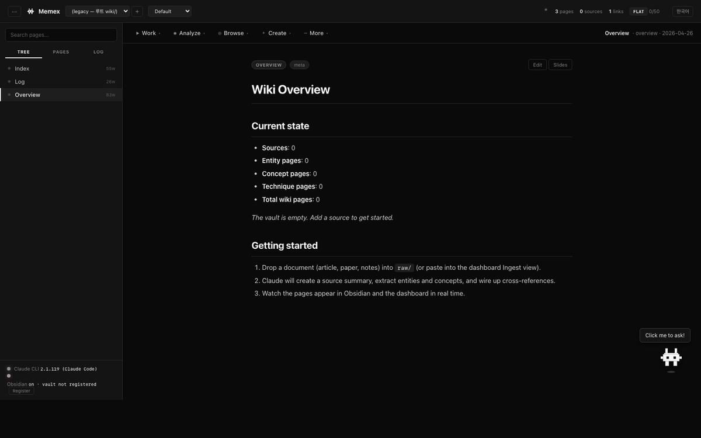
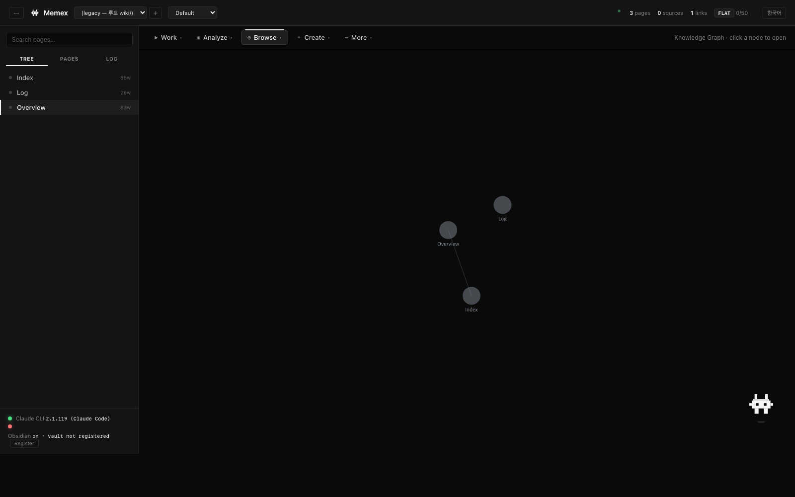
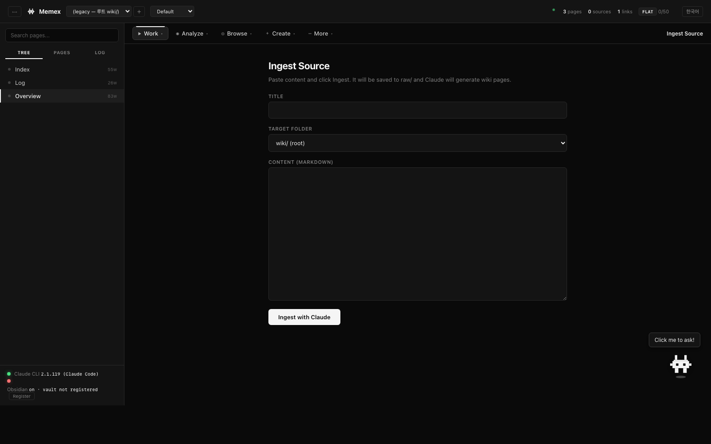

<div align="center">

<br />


<h1>Memex</h1>

<p><strong>스스로 자라는 개인 지식 베이스.</strong></p>

<p>
소스를 던지면, Claude가 정리해 둡니다.<br/>
당신의 지식은 마크다운 그대로, 통제권은 당신에게.
</p>

<p>
<a href="#설치"></a>
&nbsp;

&nbsp;

&nbsp;

&nbsp;
<a href="README.md"></a>
</p>

<br />

<p>
<em>"Obsidian이 IDE라면, Claude는 프로그래머. 위키는 코드베이스."</em>
</p>

<br />



</div>

---

## 왜?

대부분의 LLM + 문서 셋업은 **모든 질의마다 지식을 재유도합니다**. RAG는 청크를 찾고, 모델은 답을 짜 맞추고, 아무것도 남지 않습니다. 같은 문서에 열 번 물어보면 → 열 번의 재발견이죠.

**Memex는 이 흐름을 뒤집습니다.** 소스를 한 번 넣으면, Claude가 읽고, 영속 위키에 통합하고, 기존 페이지와의 모순을 표시하고, 인용을 연결하고, 커밋합니다. 10번째 질의에서는 위키 스스로 답합니다 — 정리는 이미 끝나 있으니까요.

[Andrej Karpathy의 LLM Wiki 패턴](https://gist.github.com/karpathy/442a6bf555914893e9891c11519de94f) 기반. 이름은 [Vannevar Bush의 1945년 Memex](https://en.wikipedia.org/wiki/Memex)에서.

---

## 세 가지 표면, 하나의 위키

오늘날 Memex의 주력은 네이티브 데스크톱 앱입니다. 브라우저 UI나 다른 Claude 클라이언트에서의 프로그램적 접근을 원하는 사용자를 위해 두 가지 보조 표면도 제공됩니다.

| 표면 | 설명 | 사용 시기 |
|---|---|---|
| **Memex 데스크톱 앱** (`app/`) | Tauri 2 + React, `.dmg`/`.exe`로 배포. 자체 vault 생성, 5개 LLM 프로바이더 지원. | **기본. 이걸 쓰세요.** |
| **대시보드 서버** (`dashboard/`) | Python stdlib HTTP 서버 + `localhost:8090` HTML UI. `claude` CLI 호출. | 멀티 프로젝트 전환, 웹 접근, 스크립트 ingest. |
| **MCP 서버** (`mcp-server/`) | Model Context Protocol을 통한 14개 도구. | Claude Desktop/Code 같은 MCP 클라이언트에서 Memex 조작. |

세 표면 모두 같은 vault 레이아웃(`raw/ wiki/ daily/ ingest-reports/`)을 공유하며 데이터를 잠그지 않습니다. 디스크 위의 평범한 마크다운, 언제나.

---

## 설치

### 데스크톱 앱 (권장)

플랫폼별 번들 다운로드:

- **macOS Apple Silicon**: `Memex_0.1.0_aarch64.dmg` (CI 릴리스 전까지는 [소스에서 빌드](#소스에서-빌드))
- **Windows x64**: `Memex_0.1.0_x64-setup.exe`

마운트/실행 → Applications 드래그. 첫 실행 시 Memex가 `~/Documents/Memex/`를 자동 생성하고 다음 구조로 시드합니다:

```
~/Documents/Memex/
├── CLAUDE.md            ← Claude를 위한 유지보수 규칙
├── welcome.md           ← 시작 노트
├── raw/                 ← 소스 드롭 (불변)
├── wiki/                ← Claude가 유지하는 페이지
│   ├── index.md
│   └── log.md
├── daily/               ← 데일리 노트 (YYYY-MM-DD.md)
└── ingest-reports/      ← ingest별 WHY 보고서
```

다른 폴더(예: 기존 Obsidian vault)를 쓰려면 Settings → Account → Change…

### 대시보드 / MCP (보조 표면)

Python 3.10+ (stdlib만)과 [Claude Code CLI](https://docs.anthropic.com/en/docs/claude-code) 필요.

```bash
git clone https://github.com/cmblir/memex.git
cd memex
python dashboard/server.py    # 브라우저 UI at localhost:8090
# 또는
bash mcp-server/install.sh    # Claude Desktop/Code용 MCP 서버
```

---

## 데스크톱 앱

왼쪽 사이드바에 7개 라우트. ⌘K로 명령 팔레트, ⌘B로 사이드바 토글.

### Overview

Vault 통계 (파일 수, 해결된 위키링크, 비율), 최근 git 활동, 가장 많이 편집된 노트로 점프하는 카드들.

### Ingest

1. 파일 드롭 또는 텍스트 붙여넣기 → Memex가 `raw/<slug>.md`에 저장.
2. 활성 **ingest 모델** 호출 (기본: Claude CLI), vault를 cwd로.
3. Claude가 소스를 읽고, 영향받는 wiki 페이지를 찾고, 인용을 추가하고, `wiki/source-<slug>.md`를 생성/갱신하고, `wiki/log.md`에 추가하고, `ingest-reports/<datetime>-<slug>.md`에 WHY를 기록.
4. 트리와 그래프 새로고침.

### Ask

위키에 대한 질문에 답하는 채팅 화면. 활성 **query 모델**이 vault 루트에서 실행되며 시스템 프리앰블이 `wiki/`를 먼저 Read/Grep 도구로 조회한 뒤 필요하면 `raw/`로 내려가도록 유도합니다. 세션별 대화 히스토리 유지.

### Graph

Cytoscape.js + **fcose** 레이아웃으로 vault 전체 링크 그래프. 노드는 파일, 엣지는 `[[wikilinks]]`. YAML frontmatter의 태그 칩과 폴더 드롭다운으로 부분 그래프 필터링. 노드 클릭 시 파일 열림.

### History

Vault 디렉터리의 `git log`를 읽어 각 커밋의 제목, 해시, 날짜, `+/~` 줄 수를 표시. HEAD 표기. 아직 git repo가 아니면 `git init` 가이드 인라인.

### Provenance

페이지별 **인용 커버리지** — 전체 주장 라인 vs 인용된 주장 라인. 커버리지 낮은 순 정렬, 슬라이더 임계값 미만은 플래그.

**Run lint**는 CLAUDE.md의 lint 체크리스트(구조/인용/연결/신선도)를 활성 query 모델로 보내고 Markdown 보고서를 인라인 렌더.

### Settings

6개 서브 탭:

- **Account** — 현재 vault 경로. **Change…**로 다른 폴더로 전환.
- **Model** — **Query**와 **Ingest**용 프로바이더+모델 드롭다운을 따로 지정. 한 작업의 프로바이더만 바꿔도 다른 연결은 그대로.
- **Connections** — 다음 중 원하는 조합으로 연결:
  - **Claude Code (CLI)** — Pro/Max 구독 사용. 키 불필요, PATH에 `claude`만 있으면 됨.
  - **Anthropic API** — 직접 `/v1/messages` 호출.
  - **OpenAI API** — `/v1/chat/completions`. `/v1/models`로 실시간 모델 리스트.
  - **Google AI** — `:generateContent`로 Gemini 계열.
  - **Ollama** — 로컬 `http://localhost:11434`. 설치된 모델 자동 감지.
  - **OpenRouter** — `/api/v1/chat/completions`. 80개 이상 모델 실시간 카탈로그.
  
  API 키는 OS 키체인 (macOS Keychain / Windows Credential Manager / freedesktop Secret Service)에 서비스 이름 `dev.cmblir.memex`로 저장됩니다. **디스크에 평문으로 절대 쓰이지 않습니다.**
- **Language** — EN / 한국어 / 日本語 (UI). 모델의 작성 언어는 독립.
- **Appearance** — light / dark / system.
- **About** — 버전 + 설명.

### Page reader (vault 파일)

사이드바에서 파일 클릭 → 3가지 모드로 열림:

- **Source** — CodeMirror 6, markdown 하이라이트, `[[wikilink]]` 자동완성(`[[` 입력 시 vault의 모든 노트 팝업), `⌘S` 저장, 2초 idle 자동저장.
- **Preview** — markdown-it 렌더, 위키링크는 클릭 가능한 버튼.
- **Split** — 좌우 동시. 편집 즉시 프리뷰 갱신.

페이지 하단 **Backlinks** 패널에 이 노트로 링크하는 모든 노트 목록.

트리 항목 우클릭 → **New note / New folder / Rename / Delete**. ⌘K로 파일명 stem으로 즉시 점프.

---

## 패턴

```
   ~/Documents/Memex/    당신의 vault (또는 Memex를 가리키게 한 다른 폴더)
     ├─ raw/             원본 소스. 불변.
     │    │
     │    ▼  Ingest 페이지
     ├─ wiki/            Claude가 유지하는 페이지.
     │                   인라인 인용 [^src-*]. 교차 참조.
     │                   Frontmatter 스키마 (vault별 CLAUDE.md).
     ├─ daily/           데일리 노트 (Today's note 버튼).
     ├─ ingest-reports/  각 ingest가 왜 그 결정을 내렸는지.
     └─ CLAUDE.md        Memex가 첫 실행 시 시드하는 유지 규칙.
     ▼
   Memex 데스크톱 + Obsidian (선택) + 셸 / git 클라이언트
   세 도구가 같은 파일을 봅니다. Memex는 vault를 잠그지 않습니다.
```

- **당신**: 소스 큐레이션, 질문, 경계 설정.
- **Claude**: 요약, 교차 참조, 인용, 모순 탐지, 커밋.
- **위키**: ingest마다 누적.

---

## 앱 밖에서 위키 다루기 (MCP)

데스크톱 앱은 UI 안에서 모든 작업을 노출하지만, 다른 곳에서 실행 중인 **Claude Desktop / Claude Code** 세션에서도 같은 vault에 접근하고 싶다면 MCP 서버를 쓰세요.

<details>
<summary><b>4단계 MCP 셋업</b></summary>

#### 1단계 — 서버 설치

```bash
bash mcp-server/install.sh
```

`mcp-server/.venv`에 `mcp` SDK를 설치하고 클라이언트 설정에 붙여 넣을 절대 경로를 출력합니다.

노출되는 14개 도구:

| 읽기 전용 | 쓰기 |
|---|---|
| `list_projects` `list_pages` `read_page` `search` `folder_tree` `stats` `recent_log` `list_raw_sources` `get_instructions` | `add_raw_source` `create_page` `update_page` `create_folder` `git_commit` |

#### 2단계 — 클라이언트 선택

**Claude Code (터미널 CLI):**

```bash
claude mcp add --scope user memex \
  -- "$PWD/mcp-server/.venv/bin/python" "$PWD/mcp-server/memex_mcp.py"
claude mcp list                       # memex가 보여야 함
```

**Claude Desktop:**

> ⚠️ 먼저 Claude Desktop을 완전히 종료 (macOS는 Cmd+Q).

`~/Library/Application Support/Claude/claude_desktop_config.json` (macOS)
또는 `%APPDATA%\Claude\claude_desktop_config.json` (Windows) 편집:

```json
{
  "mcpServers": {
    "memex": {
      "command": "/Users/<you>/Memex/mcp-server/.venv/bin/python",
      "args": ["/Users/<you>/Memex/mcp-server/memex_mcp.py"]
    }
  }
}
```

#### 3단계 — 검증

> 내 Memex 프로젝트들을 보여줘.

Claude가 `list_projects`를 호출하고 응답해야 합니다.

#### 4단계 — 스키마 고정 (선택)

ingest 중심 채팅 시작 시:

> `memex.get_instructions`를 한 번 호출해. 지금부터 내가 공유하는
> 사실적인 내용은 위키 ingestion으로 처리해 — 인용 포함해서 위키에 쓰고,
> 새 페이지 만들 땐 먼저 물어보고, 마지막에 커밋해.

</details>

MCP 서버, 데스크톱 앱, 대시보드 모두 같은 `wiki/` 트리를 공유합니다.

---

## 대시보드 (보조 표면)

`localhost:8090`의 브라우저 UI — 데스크톱 앱 이전부터 있던 surface. 아직도 유용한 경우:

- **멀티 프로젝트** 전환 (헤더 드롭다운, Cmd+P)
- 프로젝트별 **Wiki Ratio 게이지**
- ingest 커밋 **원클릭 되돌리기**
- **WHY 보고서** 인라인 렌더
- **이중 언어 UI** (EN / 한국어)
- **떠다니는 Claude 캐릭터** — 대시보드 도움 챗봇

대시보드는 모든 작업에 `claude` CLI를 사용합니다.

<details>
<summary>스크린샷</summary>

<table>
<tr>
<td width="50%"></td>
<td width="50%"></td>
</tr>
<tr>
<td align="center"><sub><strong>Overview</strong></sub></td>
<td align="center"><sub><strong>Graph</strong></sub></td>
</tr>
<tr>
<td width="50%"></td>
<td width="50%"></td>
</tr>
<tr>
<td align="center"><sub><strong>Ingest</strong></sub></td>
<td align="center"><sub><strong>History</strong></sub></td>
</tr>
</table>

</details>

---

## 소스에서 빌드

### 데스크톱 앱

요구사항: Node 20+, Rust 1.77+, OS별 [Tauri 사전 설치](https://tauri.app/start/prerequisites/).

```bash
cd app
npm install
npm run tauri dev       # 핫리로드 개발 윈도우
npm run tauri build     # src-tauri/target/release/bundle/ 에 릴리스 번들
```

전체 개발 가이드/아키텍처/IPC는 [`app/README.md`](app/README.md) 참고.

### 대시보드 / MCP

위에서 설명한 대로 — 컴파일 불필요, Python 3.10+만 있으면 됨.

---

## 멀티 프로젝트

대시보드는 하나의 서버에서 여러 독립 wiki를 운영하는 모드를 지원합니다. 각각 `projects/<slug>/` 아래에 자신의 `wiki/ raw/ CLAUDE.md .settings.json`을 가집니다.

생성 시 템플릿으로 `wiki/` 서브 폴더 자동 스캐폴딩:

| 템플릿 | 기본 폴더 |
|---|---|
| `generic` | `sources entities concepts techniques analyses` |
| `llm-research` | `sources models techniques concepts entities benchmarks analyses` |
| `reading-log` | `sources authors ideas quotes reviews` |
| `personal-notes` | `daily topics people projects` |

데스크톱 앱은 현재 단일 vault에 집중합니다. vault 전환은 Settings → Account → Change.

---

## 레포지토리 레이아웃

```
app/                       Memex 데스크톱 앱 (Tauri 2 + React)
  src/                       React 프론트엔드 (TS)
  src-tauri/                 Rust 셸 + IPC
  README.md                  데스크톱 앱 문서
  PLAN.md / PROGRESS.md      빌드 히스토리
mcp-server/                MCP 서버 (14개 도구)
  memex_mcp.py
  install.sh
dashboard/                 브라우저 대시보드
  server.py                  zero-dep Python API
  index.html                 단일 파일 UI
  project_registry.py        멀티 프로젝트 리졸버
  provenance.py
  index_strategy.py
CLAUDE.md                  루트 공통 스키마
projects/                  프로젝트별 vault (대시보드 / MCP)
  <slug>/
    CLAUDE.md
    .settings.json
    wiki/  raw/  ingest-reports/
projects.json              활성 프로젝트 + 레지스트리
templates/                 프로젝트 템플릿
raw/ wiki/ ...             레거시 단일 프로젝트 모드 (여전히 지원)
```

---

## 대시보드 API

대시보드 서버는 35+ 엔드포인트를 제공하며, 모두 `?project=<slug>` 쿼리(GET)나 `"project"` JSON 필드(POST)로 프로젝트 스코핑 가능.

<details>
<summary><strong>엔드포인트 전체</strong></summary>

**프로젝트 관리**

| Method | Path | 설명 |
|--------|------|-----|
| GET | `/api/projects` | 리스트 + 활성 + 레거시 정보 |
| GET | `/api/projects/active` | 현재 활성 프로젝트 |
| GET | `/api/templates` | 템플릿 + 권장 폴더 |
| POST | `/api/projects/create` | 새 프로젝트 |
| POST | `/api/projects/switch` | 활성 프로젝트 변경 |
| POST | `/api/projects/update` | 모델/제목/설명 갱신 |
| POST | `/api/projects/delete` | 소프트 삭제 → `projects/.trash/` |

**데이터 / 상태**

| Method | Path | 설명 |
|--------|------|-----|
| GET | `/api/status` | Claude CLI + Obsidian — 원시 사실 |
| GET | `/api/wiki` | 전체 wiki 데이터 (project-scoped) |
| GET | `/api/folders` | 폴더 트리 |
| GET | `/api/history` | ingest 커밋 |
| GET | `/api/provenance` | 인용 커버리지 |
| GET | `/api/query-stats` | Wiki Ratio |
| GET | `/api/raw/integrity` | raw/ 변조 검사 |
| GET | `/api/settings` | 모델 옵션 + 현재 |

**작업**

| Method | Path | 설명 |
|--------|------|-----|
| POST | `/api/ingest` | 새 소스 → wiki 페이지 |
| POST | `/api/query` | 위키 질의 |
| POST | `/api/lint` / `/api/lint/fix` | 건강 검사 |
| POST | `/api/reflect` | 메타 분석 |
| POST | `/api/write` | 글쓰기 도우미 |
| POST | `/api/compare` | 두 페이지 비교 |
| POST | `/api/slides` | Marp 익스포트 |
| POST | `/api/search` | TF-IDF 검색 |
| POST | `/api/revert` | ingest 되돌리기 |
| POST | `/api/page` / `/update` / `/delete` | 페이지 CRUD |
| POST | `/api/folder` | 폴더 생성 |
| POST | `/api/schema` | CLAUDE.md 갱신 |
| POST | `/api/assistant` | 대시보드 도우미 챗봇 |

</details>

---

## 설정

### 데스크톱 앱

`~/Library/Application Support/dev.cmblir.memex/settings.json` (macOS, 다른 OS는 동등 경로)에 저장. 작업별 선택된 프로바이더/모델, 연결 플래그, 언어 보존. **API 키는 절대 저장하지 않습니다** — OS 키체인에.

### 대시보드

```bash
# 환경 변수 (선택)
CLAUDE_TIMEOUT=1200  python dashboard/server.py
CLAUDE_QUICK_TIMEOUT=30
CLAUDE_TOOLS=Edit,Write,Read,Glob,Grep
```

프로젝트별 설정은 `projects/<slug>/.settings.json`과 `projects/<slug>/CLAUDE.md`에.

---

## Star History

<a href="https://www.star-history.com/?repos=cmblir/memex&type=date&legend=top-left">
 <picture>
   <source media="(prefers-color-scheme: dark)" srcset="https://api.star-history.com/chart?repos=cmblir/memex&type=date&theme=dark&legend=top-left" />
   <source media="(prefers-color-scheme: light)" srcset="https://api.star-history.com/chart?repos=cmblir/memex&type=date&legend=top-left" />
   
 </picture>
</a>

---

## 단축키

**데스크톱 앱:**
- `⌘K / Ctrl-K` — 명령 팔레트 (페이지/파일 점프)
- `⌘B / Ctrl-B` — 사이드바 토글
- `⌘S / Ctrl-S` — 저장 (마지막 편집 2초 후 자동 저장도)
- 에디터에서 `[[` — 위키링크 자동완성
- 사이드바 우클릭 — 새로 만들기 / 이름 변경 / 삭제

**대시보드:**
- `Cmd/Ctrl + P` — 프로젝트 선택기 포커스
- `Cmd/Ctrl + B` — 사이드바 토글

---

## 크레딧

- **패턴**: [Andrej Karpathy](https://github.com/karpathy) — *[LLM Wiki](https://gist.github.com/karpathy/442a6bf555914893e9891c11519de94f)*.
- **선조**: [Vannevar Bush, "As We May Think"](https://en.wikipedia.org/wiki/As_We_May_Think), 1945.
- **빌드 도구**: [Claude Code](https://docs.anthropic.com/en/docs/claude-code).

---

<div align="center">
<br/>
<sub>MIT License · <a href="README.md">English README</a> · <a href="app/README.md">데스크톱 앱 문서</a></sub>
</div>
